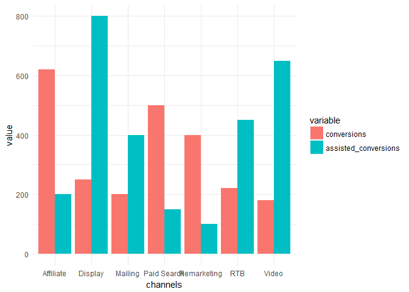
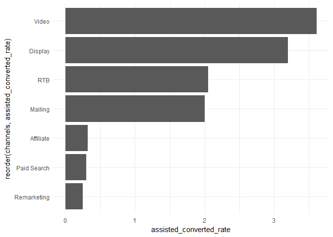
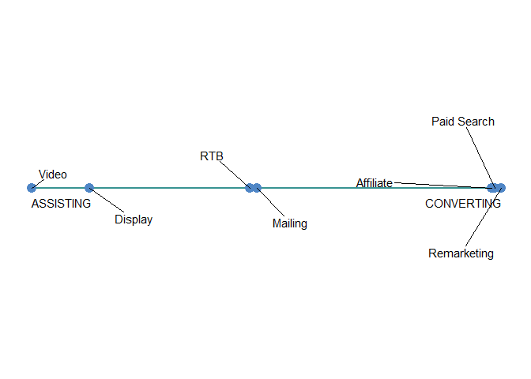

Line plot
================

This short tutorial covers visualisation technique for showing data points along the line. For the sake of breivity I'll call it *the line plot* and as a matter of fact I could not find any reference to the plot's own name. In case you know it, you're more than welcome to share the proper name.

Prepare R environment
---------------------

We're going to need some external libraries, that can be easily installed from CRAN with command *install.packages()*

``` r
# Loading packages
library(ggplot2)
library(reshape2)
library(dplyr, warn.conflicts = F)
```

    ## Warning: package 'dplyr' was built under R version 3.4.2

``` r
library(ggrepel)
```

    ## Warning: package 'ggrepel' was built under R version 3.4.2

``` r
# Clearing the workspace
rm(list = ls())
```

Example data
------------

We'll generate toy dataset. As an example I chose to reffer to online marketing world and visualise the role of a marketing channel on a simple scale that ranges from 100% assisting role (left side of plot) to 100% converting role of a channel (leaning right). + Assisting conversion - marketing activity that took place before conversion, but it was not directly the last interaction prior to desired action. + Last click conversion - marketing activity that took place before conversion and it was directly the last interaction prior to desired action.

``` r
# Data input
channels <- c("Display", "RTB", "Affiliate", "Paid Search", "Mailing", "Video", "Remarketing")
conversions <- c(250, 220, 620, 500, 200, 180, 400)
assisted_conversions <- c(800, 450, 200, 150, 400, 650, 100)

# Merging into one data frame
df <- data.frame(channels, conversions, assisted_conversions)

# Checking class of the columns (should be "factor", "numeric", "numeric")
sapply(df, class)
```

    ##             channels          conversions assisted_conversions 
    ##             "factor"            "numeric"            "numeric"

In this case, total sum of assisted conversions is clearly higher than sum of all of conversions - it is common in case of e-commerce sites as it simply means that for many paths there was more than one assisting channel.

Let's visualise simple dataset:

``` r
# Converting into long format
df_melted <- melt(df, id.vars = "channels")

# Simple dataviz
ggplot(df_melted, aes(x = channels, y = value, fill = variable)) +
  geom_bar(stat = "identity", position = "dodge") +
  theme_minimal()
```



Since this example recreates real life business situation, there are few channels that have substantially more last interaction conversions than assisted conversions (Affiliate, Paid Search, Remarketing) - they usually accompany consumers in last moments before purchase due to their intrinsic way of influencing the customer. The other channels (Display, Mailing, RTB, Video) have many assisted conversions, while having much less last click conversions - these are also successful channels that are clicked/viewed by an user who finally *will* convert, but they do not traditionally receive proper credit for doing their job. Hence the assisting conversions metric, as it helps reflecting their value.

Which channels have an assisting role and which tend to close the deals?
------------------------------------------------------------------------

That's what we seek to find out through smart data visualisation. Technically you can understand it from the plot above, but the right answer is not clear from the first glimpse (as it should be in any good data visualisation). We're going to need one simple transformation:

Assisted/Converted Rate:

``` r
# Creating new variable
df <- mutate(df, assisted_converted_rate = round(assisted_conversions / conversions, 2))
df$assisted_converted_rate
```

    ## [1] 3.20 2.05 0.32 0.30 2.00 3.61 0.25

Now that we have ratios, we could visualise them as fast as possible:

``` r
# Better visualisation
ggplot(df, aes(x = reorder(channels, assisted_converted_rate), y = assisted_converted_rate)) +
  geom_bar(stat = "identity") + 
  theme_minimal() + 
  coord_flip()
```



With reorder() magic we can sort all channels with regard to their assisting capabilities. Clearly we can see, that Video and Display are doing the most when it comes to enabling converting power in other channels (i.e. Affiliate, Paid Search, Remarketing).

Now, let's make this look *really simple* by showing each data point on one straight line - that should make such interpretation easier without losing too much information.

``` r
# First take on line plot
ggplot(df, aes(x = (-assisted_converted_rate), y = 0)) +
  geom_line(colour = "#379392",
            size = 1) + 
  geom_point(data = df, 
             aes(x = -assisted_converted_rate, y = 0),
             colour = "#4F86C6", size = 4) +
  geom_text(aes(label = channels,
                x = -assisted_converted_rate)) + 
  annotate("text", x = max(-df$assisted_converted_rate), y = 0, label = "CONVERTING", hjust = 1, vjust = 2.1) +
  annotate("text", x = min(-df$assisted_converted_rate), y = 0, label = "ASSISTING", hjust = 0, vjust = 2.1) +
  theme_minimal() +
  theme(panel.grid = element_blank(),
        axis.text = element_blank(),
        axis.title = element_blank())
```


Let's fix it. When it comes to overlapping labels, *ggrepel* package is second to none. With the magic of one simple geom\_text\_repel() function we're able to improve visibility drastically.

Final touch
-----------

``` r
# Final version of line plot
ggplot(df, aes(x = (-assisted_converted_rate), y = 0)) +
  geom_line(colour = "#379392",
            size = 1) + 
  geom_point(data = df, 
             aes(x = -assisted_converted_rate, y = 0),
             colour = "#4F86C6", size = 4) +
  geom_text_repel(aes(label = channels, x = -assisted_converted_rate), 
                  stat = "identity",
                  angle = 0,
                  force = 7,
                  max.iter = 200,
                  box.padding = unit(2, "lines"),
                  point.padding = NA) + 
  annotate("text", x = max(-df$assisted_converted_rate), y = 0, label = "CONVERTING", hjust = 1, vjust = 2) +
  annotate("text", x = min(-df$assisted_converted_rate), y = 0, label = "ASSISTING", hjust = 0, vjust = 2) +
  theme_minimal() +
  theme(panel.grid = element_blank(),
        axis.text = element_blank(),
        axis.title = element_blank())
```



Summary
-------

When it comes to conveying a simple message, which is understandable from the first glimpse, line plot undoubtedly does the job.
